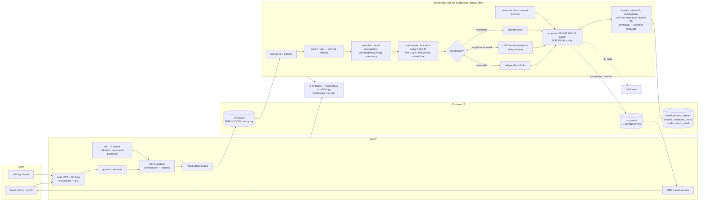

# From today's platform to a production-grade, state-of-the-art OaaS — the plan

**Written for:** whoever builds this next, including a future session of this project.
Assumes `docs/plans/2026-09-20-platform-roadmap.md` (Phases 0–5, done) and does not
re-explain it. This plan continues its numbering: **Phases 6–17**.

**Location:** this file lives at
`docs/plans/2026-09-22-optimization-target-roadmap.md`. `backend/app/solve/scip.py`
is left alone, because another session is working on it.

---

## Context

Two briefs asked for, first, a production-grade audit and rebuild (IR, IIS, persistence,
tenancy, caching, observability, live progress, tests) and, second, a state-of-the-art optimization core
(indicators, PWL, symmetry, scheduling, decomposition, LNS, portfolios, PDLP/GPU, ML, uncertainty,
multi-objective, nonlinear, advanced explanations). Both briefs describe an attached architecture that is
**not this repository**. This plan sets their target against the code that actually exists
(HEAD `40f0907`, migrations to `0028`, 1100+ backend tests).

### Verdict on the briefs' premises — what does *not* need fixing

| Brief says | Reality here | Action |
|---|---|---|
| Big-M hardcoded 1000 | No Big-M exists. Boolean structure was deferred on purpose (contract §5) | Build it properly in Phase 10 |
| `==` soft rule has one slack | One `s ≥ 0` shared by `left+s ≥ r` and `left−s ≤ r` = |deviation|. **Correct** | None |
| CP-SAT `int()` truncation | `_whole()` raises `NotIntegral`; routing keeps fractional models away | Optional scaling in Phase 6 |
| SIGALRM timeouts | Not used. Solver-native limits + `stop.py` interrupt thread + heartbeat | None |
| Celery `RLIMIT_AS` leakage | No Celery. Postgres `SKIP LOCKED` queue; HiGHS already in a child process | Per-run isolation in Phase 9 |
| In-memory `provenance_map` | Conflicts persisted on `run.conflict` by rule id + instance | None |
| "OR" string-match routing | Classification uses domains, degree, softness, fractional data, convexity | Richer fingerprint in Phase 13/17 |
| Needs Redis + Celery | A DB queue is simpler, transactional with the run row, and already correct | **Do not add a broker.** Revisit only past ~50 runs/s |
| Needs WebSocket | One-way progress → **SSE** over Postgres `LISTEN/NOTIFY`, polling stays as fallback | Phase 8 |
| Pydantic IR | Contract is `ir/contract.json` shared by TS and Python with a parity test (principle 3) | Pydantic v2 models *generated from/tested against* the contract, not a second source — Phase 10 |

### Real defects found (the audit's actual output)

| # | Severity | Defect | Where |
|---|---|---|---|
| D1 | **Critical** | Any tenant can list and cancel any tenant's runs; domain/problem tables are not org-scoped | `api/runs.py:214`, `:406`; no `organization_id` outside `iam` |
| D2 | **Critical** | HiGHS `kTimeLimit`/`kIterationLimit`/`kSolutionLimit` → `feasible` without checking a primal solution exists — a timeout with no incumbent returns garbage values | `solve/highs.py:253-271` |
| D3 | High | `run.seed` is recorded but never passed to any solver → runs are not reproducible, contradicting principle 4 | `solve/service.py:105`; no `random_seed` anywhere |
| D4 | High | Cancelling HiGHS `terminate()`s the child → the incumbent is lost | `solve/stop.py` |
| D5 | High | `UNBOUNDED` is reported as `unknown` in all three linear adapters — a modelling error hidden as a solver shrug | `highs.py`, `milp.py`, `lp.py` |
| D6 | High | No MIP gap / best bound recorded; ClickHouse `gap` column never written | adapters, `run` |
| D7 | Medium | Rows/columns added one at a time (HiGHS, pywraplp) — O(n) Python calls; slow above ~10⁵ nonzeros | `highs.py`, `milp.py`, `lp.py` |
| D8 | Medium | Lex stages freeze stage *k* as an exact `=` with no tolerance on continuous models → spurious infeasibility from float noise | `service.py _solve_lex` |
| D9 | Medium | Missing upper bound defaults to 1,000,000 — safe for LP, poison for any future Big-M | `compile.py ~332` |
| D10 | Medium | No resource limits on the worker; 8 threads hardcoded; one bad model can OOM the host | `worker.py`, `docker-compose.yml` |
| D11 | Low | Roadmap doc drift: `cancel_requested_at`/`last_heartbeat_at` vs real `cancel_requested`/`heartbeat_at`; "reclaimed at start-up" vs before every job; gap/threads listed as settings but absent | `docs/plans/2026-09-20-platform-roadmap.md` |

---

## Design principles (carried over, plus three new)

1–5 from the existing roadmap stand (structure is data; DB is last line of defence; one definition many
consumers; reproducibility is a schema property; refusals name the field).

6. **Nothing is enabled by default without a benchmark win.** Every technique ships behind a setting,
   defaults off, and flips on only after the harness (Phase 6.1) shows it helps. Rule in §Benchmarking.
7. **Honesty over coverage.** A technique that can return a wrong or unproven answer declares so
   (`optimality`, `minimal`, `approximate`) — same pattern as `proves="global|local"`.
8. **Tenancy is a column, not a convention.** Every row reachable by a tenant carries `organization_id`,
   enforced by the DB (RLS), not only by routers.

---

## Target architecture


`*` = gated on demand (Phase 14).

---

## Technique triage (the brief's table)

Impact is *for this platform's problem families* (rostering, coverage, blending, balancing — template-driven, 10²–10⁶ vars).
**P** = proven industrial practice; **R** = research-stage / immature in production.

| Technique | Helps | Impact | Effort | Maturity | Priority / phase |
|---|---|---|---|---|---|
| Correct status handling, gap, seed, batching | all | correctness | S | P | **P0 / 6** |
| Benchmark + golden harness | all | enables everything | M | P | **P0 / 6** |
| Tenancy, quotas, fair queue | SaaS | safety | M | P | **P0 / 7** |
| Observability + SSE progress | ops/UX | high | M | P | P1 / 8 |
| Per-run process isolation, limits | ops | high | S | P | P1 / 9 |
| Native indicators (CP-SAT `OnlyEnforceIf`, SCIP) + bound-derived M | logic rules | high | M | P | P1 / 10 |
| Interval vars, NoOverlap, Cumulative (CP-SAT) | scheduling | very high vs time-indexed | M | P | P1 / 10 |
| PWL (SOS2 / incremental / CP-SAT element) | step costs, curves | medium | M | P | P2 / 10 |
| Bound propagation / coef tightening presolve | Big-M models | medium (solvers do most already) | M | P | P2 / 10 — only what solvers *can't* see (IR-level bounds) |
| Native IIS (HiGHS LP), CP-SAT assumptions | infeasible | high UX | M | P | P1 / 11 |
| Min-cost relaxation, diverse IIS | infeasible | high UX | M | P (MARCO is P for SAT) | P1 / 11 |
| Sensitivity in business language, ranging | LP | high UX | S | P | P1 / 11 |
| Result cache, warm starts / hints | repeated solves | high for scenario workflow | S–M | P | P1 / 12 |
| Symmetry breaking (identical entities) | rostering | medium on MILP, low on CP-SAT (has own) | M | P | P2 / 13 |
| LNS / fix-and-optimize / rolling horizon | huge / long-horizon | high when monolithic stalls | L | P | P2 / 13 |
| Portfolio racing | ambiguous class | medium, costs 2× CPU | M | P | P2 / 13 |
| Optuna param tuning per family/tenant | repeat families | 10–40% typical | M | P | P2 / 13 |
| Separable block detection | multi-site | high when present | S | P | P2 / 14 |
| Benders / column generation / B&P | crew, shift, vehicle | very high on the right structure, zero elsewhere | XL | P (per-problem), R (automatic) | P3 / 14 — template-specific only |
| Lagrangian relaxation | bounds | medium | L | P | P3 / 14 |
| PDLP (CPU), crossover policy | LP > ~10⁷ nnz | high at that size only | S | P (OR-Tools/HiGHS) | P3 / 14 |
| GPU (cuOpt, cuPDLP) | huge LP, VRP | high at scale | L + infra | P (young) | P4 / 14 — only on demand |
| Epsilon-constraint Pareto + UI | trade-offs | high UX | M | P | P2 / 15 |
| Two-stage stochastic (SAA) + scenario reduction | uncertain demand | medium-high | L | P | P3 / 15 |
| Robust budgeted (Bertsimas–Sim) | uncertain coefs | medium | M | P | P3 / 15 |
| Chance constraints (SAA + indicators) | service levels | medium | M | P | P3 / 15 |
| Bilinear/McCormick, general NLP/MINLP (SCIP), IPOPT local | nonlinear | niche today | L | P | P3 / 16 |
| Learned solver selection | routing | medium, needs ≥ few k runs | M | P (simple GBDT) | P3 / 17 |
| NL → IR with validation | onboarding | high UX | M | P (with validator gate) | P2 / 17 |
| GNN branching / learned primal heuristics | MILP | unproven outside lab | XL | **R** | Not planned; revisit yearly |
| Learned variable-fixing | repeat families | medium | L | R→P (as LNS seed only) | P4 / 17, as an LNS destroy operator |

---

## Phase 6 — Correctness and the safety net (~3 weeks) — **do first**

### 6.1 Benchmark + golden-model harness (lands before any fix, so fixes are measured)

- `backend/bench/` package:
  - `families/` — seeded **generators** per template (`weekly_rota`, `shift_coverage`, `feed_blend`,
    `load_balance`, + one scheduling family added in Phase 10) at sizes S/M/L/XL. Output = (IR, dataset JSON)
    that goes through the real `validate → compile → choose → solve` path.
  - `mps/` — MIPLIB 2017 "benchmark/easy" subset (≈30 instances, stored via download script, not
    committed) run **directly through adapters** (an `mps_to_compiled()` loader). This lane measures
    solver-parameter techniques only; IR-level techniques can't be tested on MPS.
  - `golden/` — ~40 small models with **known optimal objective, status and conflict set**
    (hand-verified; includes infeasible, unbounded, time-limited, soft, lex, quadratic). Each is a
    pytest case, run in `scripts/check.sh`.
  - `run.py` — `python -m bench.run --family rota --sizes S,M --technique warm_start=on,off --seeds 5`
    → JSON rows `{instance, technique, seed, status, obj, bound, gap, time, primal_integral, wrong}`.
  - `report.py` — shifted geometric mean (shift 10 s), win/loss/tie, per-instance regressions; writes
    `bench/results/<date>-<technique>.md`.
- Table `bench_result` (migration `0029`) so the history is queryable; nightly CI job on L sizes.
- **Enable-by-default rule:** ≥10% SGM improvement in time-to-optimal *or* final gap on ≥2 families,
  no instance >2× slower, **zero wrong answers** (status or objective disagreeing with golden/another
  backend beyond tolerance 1e-6 rel).
- **Equivalence tests for reformulations:** for every rewrite (soft, lex, indicator, PWL, McCormick,
  robust), enumerate all assignments of tiny models (≤12 binaries) and assert the original and rewritten
  model agree on feasibility and objective. Lives in `backend/tests/test_reformulate_equivalence.py`.

### 6.2 Fixes

- **D2 status:** in `highs_worker.py`, read `info.primal_solution_status == 2` (feasible) before
  mapping limit statuses to `feasible`; otherwise `unknown` with reason `"stopped before any solution"`.
  Add the same guard for pywraplp `FEASIBLE`. Golden cases: timeout-with / without-incumbent.
- **D5 unbounded:** add run status/outcome `unbounded` (migration `0030` extends the enum + UI copy:
  "a goal can improve forever — a variable is missing a bound or a rule"). `kUnboundedOrInfeasible` →
  re-solve with objective stripped to disambiguate.
- **D3 seed:** a `SolveParams` dataclass (`time_limit, threads, seed, gap_rel, hint`) passed to every
  adapter; CP-SAT `random_seed`, HiGHS `random_seed`, SCIP `randomization/randomseedshift`, pywraplp
  via `SetSolverSpecificParametersAsString`. Test: same seed + `threads=1` → identical assignment.
- **D6 gap:** adapters return `best_bound`; `run.best_bound`, `run.gap` (migration `0030`). Gap =
  `|obj − bound| / max(|obj|, 1e-9)`; `0` when both are `0`; `null` when no bound; sense-agnostic
  because of the absolute value; documented against HiGHS's own `mip_gap`. Settings `solve.gap_rel`,
  `solve.threads` added (closes D11's third point).
- **D4 incumbent on stop:** HiGHS child registers the MIP improving-solution callback
  (highspy ≥ 1.8 `setCallback`/`kCallbackMipImprovingSolution` — verify against pinned version) and
  streams incumbents over the pipe; on cancel, send `cancelSolve` via the interrupt callback, fall back
  to `terminate()` after 3 s; the last streamed incumbent is the result, status `feasible`.
- **D7 batching:** build CSR arrays once in `compile.py` (`Compiled.to_csr()`); HiGHS `passModel`/
  `addRows` with arrays; pywraplp keeps per-row but through `MPModelProto` load (`LoadModelFromProto`).
  Bench proves the win at L/XL.
- **D8 lex tolerance:** freeze stage k as `≥/≤ obj_k ∓ max(1e-6·|obj_k|, 1e-9)` for continuous models;
  keep exact `=` for integral ones.
- **D9 bounds:** keep the 1e6 default for LP only, mark such variables `bound_source="default"` in
  `Compiled` so Phase 10's reformulator refuses to derive M from them.
- **CP-SAT fractional scaling (optional, gated):** if every fractional number has ≤ k decimals (k ≤ 4)
  and scaled coefficients × bounds fit in 2⁵³, multiply each row by 10ᵏ, divide by the row gcd, and
  admit it to CP-SAT. Objective scaled the same, then un-scaled when reported. Otherwise routing is unchanged.
  Enabled only if the bench shows CP-SAT beating HiGHS on those instances.
- **D11:** correct the roadmap doc.

**Progress (2026-09-22):** D2, D3, D5 (with D9's marking: an answer on a
ceiling the model never set is re-solved with it raised, and becomes
`unbounded` if the goal improves), D6, D8 and D11 are done (migration
`0029`); the `solve.gap_rel` setting is migration `0030`, runs use
`solve.workers`, and "optimal" requires a recorded gap of at most 1e-6. D4 is
done: HiGHS is stopped through its own `cancelSolve()` and a stopped run keeps
the answer it had. D7 is done for HiGHS -- rows and columns go in as arrays,
2.0 s to 0.23 s on a 200,000-entry model -- which also fixed a dropped
constant rule (`0 >= 1` vanished and an infeasible model got an answer).
The golden suite is `backend/tests/test_golden.py`: 15 hand-solved models on
every backend that takes them. The harness is `backend/bench/`: four seeded
families (`rota` IP, `facility` MILP, `feed_blend` LP, `load_balance` QP) at
S/M/L/XL, the MIPLIB lane (`bench.mps` reader, `bench.download_miplib`, files
not committed), `bench.run` with the wrong-answer check and `--store` into
`bench_result` (migration `0031`), and `bench.report` with the SGM and the
enable-by-default verdict. First result: `bench/results/2026-09-22-rota-cpsat-threads.md`
-- CP-SAT on one thread cannot prove the rota optimum in 20 s; on eight, 30 ms.
The nightly job is `scripts/nightly.sh` (2026-09-23): every check on a
clean `master`, then `bench.nightly` on the L instances, stored and
compared with the previous night, scheduled at 03:00 -- the CI, since there
is no remote for a hosted one. The primal integral is `bench.primal`
(2026-09-23, migration `0038`): Berthold's area under the primal gap, from
the incumbents a backend streams plus its final answer, in every row, the
report and `bench_result`; backends that stream nothing (GLOP, the MILP
wrapper) are charged until they finish. D7 is done for the pywraplp backends too (2026-09-23): GLOP and
the MILP wrapper load one `MPModelProto` -- 0.435 s to 0.043 s on 200,000
entries, measured against the expression build and per-entry coefficients
first (`bench/results/2026-09-23-pywraplp-build.md`). CP-SAT fractional scaling
is `app/solve/scaling.py` behind `solve.cpsat_scaling` (migration `0039`):
each rule times 10^k over its gcd, exact, at most 4 decimals and under
2^53. Measured with two new families (`rota_rates`, `knapsack`) and a
routed technique: every optimum agreed; CP-SAT won 17 of 18 up to L but
was 2.6x and 9.4x slower on the XL rota, so it stays off
(`bench/results/2026-09-23-cpsat-scaling.md`). A run records `needs` at
submit, before scaling admits it, so a scaled run still lists
`fractional-data` there. The MIPLIB lane has run (2026-09-23): the ten
default instances plus MIPLIB's solution file, every answer checked
against the published optimum; 0 wrong, air05 and p200x1188c proven equal
to it (`bench/results/2026-09-23-miplib.md`). **Phase 6 is complete.**

**Exit:** golden suite green on every backend; timeout-without-incumbent can't return values; two runs
with the same seed reproduce; gap visible in the Runs UI.

---

## Phase 7 — Multi-tenancy, auth, quotas, fair queueing (~3 weeks)

**Decision 6/T needed** (see Decisions): what a tenant is. Assumed: `iam.organization`.

- Migration `0031`: `organization_id uuid not null` on `domain` (and by FK chain everything below it);
  denormalised onto `problem` and `run` for cheap filtering; backfill to the seed org.
- **Postgres RLS** policies on those tables using `current_setting('app.org_id')`, set per request in
  the session dependency (`api/deps.py`) and per job in the worker. Routers also filter (fast 404
  rather than empty lists).
- Fix D1: `GET /runs`, `GET/POST /runs/{id}/cancel` scoped; cross-org access → 404.
- **API keys:** `iam.api_key(id, organization_id, prefix, hash, capabilities[], expires_at, last_used_at)`;
  `Authorization: Bearer sk_<prefix>_<secret>`; bcrypt/argon2 hash; capabilities ⊆ the creator's.
- **Quotas** `iam.quota(organization_id, max_concurrent_runs, max_queued_runs, cpu_seconds_month,
  max_time_limit_s, max_vars)`; checked at submit (422 naming the quota), CPU-seconds metered from
  `run.wall_time_s × threads` into `iam.usage_month`.
- **Fair claim:** `claim_next` orders queued runs by (org's currently running count ASC, priority,
  created_at) and skips orgs at `max_concurrent_runs` — one SQL statement with a CTE, still `SKIP LOCKED`.
- **Rate limit:** per-key token bucket in Postgres (`UPDATE ... RETURNING`), 429 with `Retry-After`.
- Tests: two-org fixtures; every list/detail/cancel route asserted isolated; property test that no query
  in `api/` lacks the org filter (grep-level lint in `scripts/check.sh`).

**Progress (2026-09-22):** tenancy and D1 are done, as migration `0032` (on
the decision's stated assumption: a tenant is an `iam.organization`, a
domain belongs to one). Every tenant table carries `organization_id`, filled
from the parent by trigger, and a row whose parents are in different
organizations is refused. RLS is enforced for the role API requests switch
to (`solver_app`) -- the app connects as `solver_runtime` (migration
`0037`: not a superuser, but BYPASSRLS for system code), which bypasses RLS --
and fails closed without `app.org_id`; each request is pinned to one
connection so the tenant cannot be lost at a commit. Roles, capabilities,
setting keys, templates and platform settings are shared and writable only
by an operator organization (`is_operator`, the seed `default`). Instead of
a grep lint, `tests/test_tenancy.py` asserts every public table is a tenant
table under RLS or on an explicit shared list. Quotas and fair claim are
migration `0034`: `iam.quota` (null = unlimited; checked at submit, 422
naming the quota; `max_concurrent_runs` at claim), CPU-seconds metered by a
trigger into `iam.usage_month`, and `claim_next` takes the oldest run of the
organization with the fewest in progress, serialised by an advisory lock so
the concurrency quota is exact. Run priority is not modelled yet. The
tenant a request's session carries is `app.org_id`, which any SQL in that
session can change with `set_config()`: RLS stops application bugs, not
injection (parameterised SQL does). If that ever has to hold against
injection too, the idea on record is a signed tenant -- the API sets
`app.org_id` with an HMAC of it under a secret only a SECURITY DEFINER
`app_org()` can read, and the policies call that -- together with an API
login without BYPASSRLS and definer functions for sign-in and API keys. API keys
and the rate limit are migration `0035`: `sk_<prefix>_<secret>`, a keyed
SHA-256 of the secret (random, so a slow hash would only cost every request
time), capabilities a subset of the maker's and intersected with them on
every request; a key cannot mint or revoke keys. The rate limit is a
per-caller token bucket in Postgres at the quota's `requests_per_minute`,
429 with `Retry-After`; refused requests spend nothing. A page at
`/api-keys` makes (showing the token once), lists and revokes keys. Phase 7
is complete.

---

## Phase 8 — Observability and live progress (~2 weeks)

- **Logs:** `structlog` JSON, bound `run_id`, `org_id`, `trace_id`, `solver`; uvicorn and worker share config.
- **Metrics:** `prometheus_client` — `solve_seconds{solver,class,status}` histogram, `run_gap` gauge at
  finish, `queue_depth{org}`, `queue_wait_seconds`, `worker_busy`, `diagnose_probes_total`; `/metrics`
  on API and a sidecar port on the worker.
- **Tracing:** OpenTelemetry; API span injects `traceparent` into `run.params.trace`; worker extracts
  it, spans `compile`, `choose`, `solve`, `diagnose`, `persist`. OTLP exporter configurable.
- **ClickHouse writer:** on run settle, insert `run_fact` (schema already exists) — basis for Phase 17.
- **Progress events:** table `run_event(run_id, seq, at, kind: incumbent|bound|log|stage, payload)`,
  written throttled (≤2/s) from adapter callbacks (CP-SAT `CpSolverSolutionCallback`, HiGHS callback,
  SCIP event handler); `pg_notify('run_<id>', seq)`.
- **SSE** `GET /api/v1/runs/{id}/events` (`sse-starlette`): replays from `Last-Event-ID`, then LISTENs;
  heartbeat comment every 15 s; closes on terminal status. Frontend `EventSource` with automatic
  reconnect; falls back to the existing 1 s polling when SSE fails twice. Runs UI shows a live
  incumbent/bound chart (primal–dual curve).
- Retention: `run_event` pruned 30 days after settle (setting); `solution` kept by default,
  `retention.solution_days` per org optional.

---

**Progress (2026-09-22):** progress events and the stream are done, as
migration `0036`. `run_event` records each better answer (`incumbent`) and
each tightening of the bound (`bound`), throttled to two a second per run,
from CP-SAT's solution and best-bound callbacks, HiGHS's improving-solution
and interrupt callbacks (relayed from its child process as JSON lines) and
a SCIP event handler; plus `stage` events (compiled, solving, settled). Each
write does `pg_notify('run_<id>')`. `GET /api/v1/runs/{id}/events` replays
from `Last-Event-ID`, then LISTENs, with a keep-alive every 15 s, closing
when the run settles; the browser reads it with `fetch` rather than
`EventSource` (which cannot send the Authorization header) and falls back to
the existing polling after repeated failures. The Runs page draws the
answer and the bound closing on each other, live and in replay. Structured logs are
done (2026-09-23): `app.core.logs` renders every line as JSON through
structlog -- stdlib and uvicorn lines too -- with the worker binding
`run_id`, `org_id` and then `solver`, and the API writing one line per
request with the organization (carried on `request.state`, since a
dependency's context is a copy). Metrics are done too
(`app.core.metrics`): the worker serves `solve_seconds`, `run_gap` (a
histogram), `runs_total`, `queue_wait_seconds` and `worker_busy` on 9100,
the API `queue_depth{org}` (counted at scrape) on 9101 -- internal ports,
not published, since queue depth names organizations; no Prometheus server
is deployed yet, and `diagnose_probes_total` is not counted. Tracing is done
(`app.core.tracing`): the API's request span is the root, `enqueue_run`
puts its context on `run.params.trace`, and the worker continues it under
a `run` span with `compile`, `choose`, `solve`, `diagnose` and `persist`;
exported as JSON log lines by default, or over OTLP. Its first finding:
`choose` takes ~200 ms of a run whose solve takes 1 ms -- every backend's
`is_available()` is asked on every run. The `run_fact` writer is
done (`app.analytics`, migration `0040`): the worker sweeps settled runs
whose fact is unwritten (`run.fact_written_at`, an outbox) into a
ReplacingMergeTree keyed by run, so every way a run settles is covered and
a ClickHouse outage only delays it; the first sweep backfilled every run.
Retention is done too
(`app.retention`, migration `0041`): `run.event_retention_days` (30, 0 =
for ever), resolved per run at every settings level, pruned by the worker
at start-up and hourly; the run, its answer and its fact stay. Not built:
`retention.solution_days` (the plan calls it optional; `run.retention_days`
has existed since 0014 and nothing enforces it). **Phase 8 is complete.**

---

## Phase 9 — Worker isolation and resource control (~1–2 weeks)

**Decision 4 (where solvers run) is answered here:** a worker container pool; each run solves in a **fresh
subprocess** (generalise the HiGHS child pattern into `solve/sandbox.py`). The subprocess:
`resource.setrlimit(RLIMIT_AS, mem_limit)`, `RLIMIT_CPU` = time_limit × threads + grace; the parent
enforces a hard wall deadline = time_limit + 15 s → SIGTERM → SIGKILL. The parent's DB session is never
shared with the solver.
- Worker count and threads from settings/env, not hardcoded 8; `docker-compose` gets `mem_limit`/`cpus`.
- An OOM or kill becomes `status=failed, reason="ran out of memory at N MB"` instead of a dead worker.
- Windows dev: `RLIMIT` unavailable → the sandbox degrades to deadline-only, logged once.

**Progress (2026-09-23):** done as `app/solve/sandbox.py`. A run's solve and
its diagnosis each run in a child forked from a `forkserver` that has the
solvers preloaded (a fresh interpreter per run would cost seconds): an
`RLIMIT_AS` of `SOLVE_MEMORY_MB` (4096), an `RLIMIT_CPU` of time limit x
workers + 30 s, and a wall deadline of time limit + 15 s, SIGTERM then
SIGKILL. Progress and a stop request cross the pipe. An allocation that
fails -- as MemoryError, ENOMEM, an extension that cannot be mapped or
bad_alloc -- the CPU allowance, a crash or the deadline become a run with
status `error` (the enum has no `failed`) and that reason; the worker goes
on. compose caps the worker at 12g / 8 CPUs and the API at 2g / 4.
Checked live: at 64 MB a run ends "ran out of memory (limit 64 MB)" and the
same worker solves the next at 4096 MB. The cost: the backend suite went
from ~218 s to ~275 s, one fork per run. On Windows (no fork) the sandbox
is off and solves are in-process (`SOLVE_SANDBOX=0`), rather than the
deadline-only mode sketched above. Worker count stays one process per
container; run more containers for more parallel runs.

---

## Phase 10 — IR v2: logic and structure (~5–6 weeks)

**Contract stays the single source.** `ir/contract.json` → `"version": 2`; v1 documents are valid v2
(pure superset), and a migration function `upgrade_v1()` is kept anyway. Pydantic v2 models in
`backend/app/ir/models.py` (strict, `extra="forbid"`, discriminated unions on `kind`) are **checked
against contract.json by a parity test**, and `validate.py` keeps the domain checks Pydantic can't express
(set references, index arity). Adds:

| New construct | IR form (sketch) | CP-SAT | HiGHS / MILP | SCIP |
|---|---|---|---|---|
| Implication / indicator | `{"when": <binary var term>, "then": <rule>}` | `OnlyEnforceIf` | tight Big-M: `M = maxactivity(left−right)` from **declared** bounds; refuse with reason if any bound is `default` | `addConsIndicator` |
| Disjunction | `{"any_of": [rule, ...], "at_least": k}` | reified bools + `AddBoolOr`/sum | one binary per branch + tight M | indicators |
| all_different | `{"all_different": term over set}` | `AddAllDifferent` | refuse → route to CP-SAT | refuse |
| Interval / NoOverlap / Cumulative | variable kind `interval {start, size, end, optional_when}`; rules `no_overlap`, `cumulative {demand, capacity}` | native | refuse with "scheduling rule — solved by CP-SAT" | refuse |
| Piecewise-linear | term `pwl {x, breakpoints[], values[]}` | `AddElement` / table on integer x | convex & minimised → epigraph (no binaries); else **incremental** (δ-formulation; stronger LP relaxation than convex-combination with binaries) | SOS2 |
| abs / min / max | terms | `AddAbsEquality`, `AddMin/MaxEquality` | epigraph when convex-compatible, else binaries | native |

- **Reformulator** `backend/app/solve/reformulate.py`: runs between `compile` and the adapter, driven by
  the backend's declared capabilities (`supports_indicator`, `supports_sos`, `supports_interval` added to the
  registry) and never rewrites what the backend can take natively. Every rewrite is recorded in
  `Compiled.provenance` (row → rule id, instance, rewrite kind) and persisted in `run.params.reformulations`.
- **IR-level presolve** `solve/presolve.py`: bound propagation through the IR's linear rules (a few
  FBBT rounds) **only to tighten M and PWL domains** before rewriting; solver presolves do the rest, so
  redundancy removal/coefficient tightening are *not* re-implemented (bench would not justify it).
- **Classifier** gains `needs`: `indicator`, `scheduling`, `all-different`, `pwl-nonconvex`; `choose()`
  then routes scheduling to CP-SAT automatically.
- A scheduling template (`job_shop` or `nurse_shifts_with_breaks`) + bench family, time-indexed vs
  interval formulation compared (expect interval to win by orders of magnitude on long horizons).
- Frontend: editor support for each construct (catalogue-driven, same TermBuilder), TS validator parity.

**Progress (2026-09-23):** slice 1, the contract, is done. `contract.json`
is `version` 2 with `acceptedVersions` [1, 2]: version 2 is version 1 plus
what this phase adds, so every stored document stays valid; both
validators read either, the editor writes 2, `upgrade_v1` only restamps.
`app/ir/models.py` types the IR (strict, `extra="forbid"`; terms are a
union keyed by their kind's key, as the IR has no `kind` field), and
`tests/test_ir_models.py` binds it to the contract -- vocabularies,
versions, keys, name pattern and index limit equal the JSON; the shared
fixtures run through both; every rule code is placed as structural (the
models refuse it) or semantic (`validate.py`, still the gate). Checked
live: a version 2 model publishes and solves, version 3 is a 422, and the
editor opens a version 2 model. Slice 2, indicators, is done
(2026-09-23): a constraint may carry `when: {var, index, is}` (version 2
only) -- it holds while that binary decision has that value. CP-SAT takes
it as an enforcement literal, SCIP as its own indicator constraint; SCIP
now also takes the linear classes at rank 2, for the one case only it can
hold (a conditional rule over continuous decisions). The IR form is a
switch on a rule rather than the sketch's `{when, then: rule}`: one rule,
one id, so conflicts, slack and scenario patches keep working by id.
Refused with a reason: `when` in version 1, on a non-binary, on a soft
rule, on a product. Pinned by hand-worked golden models and 80
brute-force equivalence cases. Slice 3, big-M, is done
(2026-09-23, `app/solve/reformulate.py`): for a backend with no native
indicator (HiGHS, the MILP wrapper) each conditional instance becomes
`expr <= rhs + M(1 - L)` (mirrored for `>=`, both halves for `=`), M the
most the expression can pass its bound over the **declared** box -- the
tightest correct M; rows that can never break are dropped. `admit` (run
from `refine`) allows it only when no variable in a conditional rule rests
on the guard ceiling; otherwise those backends are refused with the
variable named and CP-SAT or SCIP take the rule natively. The run records
`params.reformulations` (rule, rows, largest M). A bounded mixed model now
goes to HiGHS (rank 1) rather than SCIP. Not built: the IR-level bound
propagation (FBBT) the plan mentions for tightening M further -- declared
bounds already give the exact M for the box, and nothing yet shows a need.
Slice 4, piecewise-linear, is done (2026-09-23, `6ebc2a1`): a term
`{"pwl": {var, index}, "points": [[x, y], ...]}` (version 2, points in
strictly increasing x) is f(x) by interpolation, x kept within the first
and last point. The compiler gives each (x, curve) one auxiliary y -- whole
when x is whole and f is whole at every whole x. CP-SAT holds it as an
AddElement table, SCIP as SOS2 (`pwl-native`); for HiGHS and the MILP
wrapper `reformulate.pwl_rewrite` writes an epigraph when y appears only in
a weighted goal that pushes a convex curve down (or a concave one up), else
the incremental formulation. `admit_pwl` (from `refine`) turns the need into
`pwl-convex` in the first case -- GLOP provides that -- and otherwise makes
an LP a MILP. The run records `params.reformulations` (kind, x, segments);
auxiliaries (`__` names) never reach the roster, reduced costs or a
conflict, since a non-native diagnosis rewrites per probe. The editor keeps
and shows a curve but cannot draw one yet (the editor slice). The plan's
`pwl-nonconvex` need became `pwl` / `pwl-convex`, named by what a backend
provides rather than what the curve is. Slice 5, scheduling constructs, is
done (2026-09-23, `3b629fa`); the item was split, and the template + bench
family comparing the interval formulation with a time-indexed one is its
own slice (10b). An interval is a variable of domain `interval` naming its
integer `start` and `end` variables, a `size` (whole number or parameter)
and optionally a binary `presence` -- not a new term kind: rules and goals
read the start and end as ordinary variables (makespan is `finish <=
makespan` rows). `no_overlap` / `cumulative` are constraints in place of an
expression, over the intervals an `over` ranges across, per `forall`
instance; each instance compiles to a `Constraint` carrying a `Schedule`,
so ids, conflicts (a probe subsets them like any rule), result rows and
scenario `disable` work unchanged; a softened one, or a fractional size or
demand, is refused by name. The classifier's `scheduling` need is CP-SAT's
alone (the plan's `supports_interval`), and `solve_compiled` refuses to
hand one to anything else. Slice 10b is done (2026-09-23, `cf75153`): the
`workshop` template (three jobs cut then welded; the route is a
machine-to-machine relationship a `via` walks; CP-SAT's 9 is Johnson's
rule's makespan and a lower bound), and the bench families `flow_shop`
(intervals) and `flow_shop_timed` (run/start binaries per slot) on
identical data. The plan's expectation held: at L (4 machines, 15 jobs,
horizon ~125) CP-SAT proves the interval model in 0.03 s and the
time-indexed one in 31 s, and HiGHS, the MILP wrapper and SCIP find no
answer to it in 60 s (`bench/results/2026-09-23-flow-shop-formulations.md`).
The time-indexed family is comparison-only: at the nightly's 30 s limit it
would flip between proven and not. Slice 10c, the editor for conditions
and curves, is done (2026-09-23, `2ff854d`): a rule's "Only while a
yes-or-no decision is set" (binary switches only, indexed from the rule's
bindings; dropped when the rule is made preferred), and a curve term (a
whole or fractional variable, decimal points, out-of-order points named
before Publish). One `ReferencePicker` serves plain references, a curve's
variable and a switch, and keeps intervals out of "a variable". Every
style shows a switched rule: "while open" on the node, an "Applies" row,
a line labelled "switch" (Rete and Flow draw from the same graph), the
condition in the block view. Found on the way: the editor published a
version 1 base as version 1, so neither could be added to an older model;
it now always writes version 2. Validator parity needed nothing new -- the
shared fixtures already bind both. Slice 10d is done (2026-09-23,
`5343dc6`): "a span of time" adds an interval together with its start and
end, whose parts are then chosen from declarations over its own sets; a
scheduling rule is added and edited in full (never overlap / share a
capacity, For every, Over, interval, demand, capacity); the Remove guard
counts switches, scheduling rules and interval parts. **Phase 10 is
complete.**

---

## Phase 11 — Explanations 2.0 (~3 weeks)

- **Native IIS:** HiGHS LP `getIis` (verify availability in pinned highspy; fallback to current
  deletion filtering); CP-SAT: one enforcement literal per rule instance, `AddAssumptions`, then
  `SufficientAssumptionsForInfeasibility()` (core, not guaranteed minimal → shrink with deletion
  filtering on the core only, which is far cheaper than on the model). MILP: deletion filtering stays.
  `conflict_minimal` semantics unchanged. Bench: probes and time per diagnosis.
- **Minimum-cost relaxation** ("cheapest set of rules to give up"): every hard rule gets a
  relaxation indicator `r_i` with cost from a new `priority` field (1–5 → weights 1, 10, 100, …) ;
  minimise Σ cost·r_i subject to rule_i enforced unless r_i. Also a **quantitative** variant via the existing elastic
  compiler (min weighted violation). Result persisted in `run.relaxation`, UI: "Drop *Max 5 nights*
  for 2 nurses, or *Min coverage Tue* by 1".
- **Diverse IISs:** MARCO-style loop: after an IIS S, add a blocking clause (not all of S enabled) over
  the rule-level assumption literals, search again; stop at N=5 or budget; report the *hitting set*
  ("every conflict involves *Weekend cover*").
- **Sensitivity in business language:** LP duals ×  the rule's unit and display names →
  "One more nurse on Tuesday lowers cost by $X (valid from 3 to 7 nurses)", ranges via HiGHS
  `getRanging`. MILP: duals of the **fixed-integer LP** re-solve, labelled "local: holds while the
  schedule's shape stays the same" (principle 7). What-if button creates a scenario patch and a run.

---

**Progress (2026-09-23):** native IIS is done (`79d8b1a`). `highs.iis`
asks HiGHS for an infeasible subset of a linear model's relaxation, in the
HiGHS child; `diagnose.explain` treats it as a *core* -- confirmed
infeasible with the run's own backend, then shrunk by deletion filtering on
the core alone -- so the verdicts stay the run's and the result is proven
irreducible, for any backend. No core (relaxation feasible, switches,
curves, scheduling, HiGHS not finishing) and the full search runs. The
run records `conflict_method` / `_probes` / `_seconds`. Measured
(`bench/results/2026-09-23-native-iis.md`): never more probes, 2 against
45 where the conflict is small in a big model, little saved where it is
most of the model, ~0.5 s fixed for the HiGHS child. HiGHS's
`Irreducible` flag took 49 s against 1 s on a 12,340-row relaxation and
ignores `time_limit`, so it is off. CP-SAT assumption cores are done
(`3ec5a42`): `cpsat.core` enforces each rule instance by a literal of its
own (beside a `when` switch) and reads
`SufficientAssumptionsForInfeasibility` back; `explain` takes an ordered
list of named cores and a CP-SAT run tries its own first. On rota it is
the fastest of the three (2 probes, 0.01-0.12 s) and it is exact where
only whole numbers conflict, where HiGHS's relaxation has no core. No
CP-SAT core for scheduling rules (no enforcement literal on NoOverlap or
Cumulative). Minimal conflicts are done with them: a confirmed core is
shrunk on itself alone (1 + its size in probes, pinned) and a shrink cut
short says it is not minimal. A faster shrink was considered and not
built: facility L's conflict is 263 of its core's 340 instances, and
proving each member needed costs a probe per member whatever the order,
so QuickXplain-style splitting cannot help where the conflict is most of
the core. The explanations UI is done (`4cd7b4b`): the run page leads each
conflicting rule with its author's note, and says how the list was found
and what making sure of it cost. The queue's Phase 11 items are complete;
this section's minimum-cost relaxation, diverse IISs and sensitivity in
business language were never queued and remain open.

## Phase 12 — Caching and warm starts (~2 weeks)

- **Result cache:** key = sha256(ir_hash, dataset_hash, scenario_patch, solver, SolveParams incl. seed).
  A submit whose key matches a *completed, proven-optimal* run returns that run (new row with
  `reused_from`), no solve. Proven-optimal only; feasible/time-limited results are hints, not answers.
- **Warm start:** nearest prior run = same `model_version` lineage (or parent version), same problem,
  most recent completed. Map assignments by variable key `(name, index-tuple)`; unknown keys dropped.
  CP-SAT `AddHint` (+ `repair_hint` when the hint may be infeasible), HiGHS `setSolution`, SCIP
  `addSol`/`createPartialSol`. Recorded as `run.params.warm_start_from`. Setting `solve.warm_start`
  default **off** until bench (scenario families: perturb 5% of data, re-solve) shows the win.


**Progress (2026-09-23):** the result cache is done (`0a5dd98`, migration
0042). The key is a sha256 of the version's `ir_hash`, the frozen
`data_hash`, the scenario patch, the solver asked for, the seed, `gap_rel`,
`cpsat_scaling` and the compiler version -- not the time limit or the
thread count, which a *proven* optimum does not depend on (the plan's
"SolveParams" read that way). A match on a run with status `optimal` and
optimality `global` records a new run already finished, `reused_from` it,
its answer and rule results copied, `wall_time_s` 0, nothing queued;
infeasible, time-limited and local results are never reused;
`RunRequest.reuse: false` solves again. On the way: the run page's event
stream reconnected for ever for a settled run with no events (every reused
run), fixed in `be8b230`. Warm starts are done (`21bff11`, migration 0043),
**off by default on the bench's evidence**: `app.solve.warm` hints the
nearest earlier answer of the problem (same version first) to CP-SAT
(`add_hint`), HiGHS (sparse `setSolution`) and SCIP (a partial solution);
the run records `warm_start_from` and `_hinted`. What a stored roster can
hint is exact only for yes-or-no decisions -- it keeps which amounts were
used, not how much -- so a MILP gets its switches hinted and its
quantities left. On 28 perturb-and-resolve solves (rota, facility,
knapsack M/L) every solve was proven and warm agreed with cold; HiGHS was
4% and SCIP 3% faster by SGM, within the noise, and CP-SAT slower
(`bench/results/2026-09-23-warm-start.md`). A problem whose runs end at the
time limit can turn it on at its own level; storing values (queue item 17)
would make the MILP hint whole. The queue's Phase 12 items are complete.
---

## Phase 13 — Search power (~5 weeks)

- **Symmetry breaking:** detect entities of one type whose frozen attributes, parameters and incident
  relationships are identical (hash of signature) and that appear symmetrically in every rule →
  lexicographic ordering on their aggregate load (`Σ x[e1,·] ≥ Σ x[e2,·]`). **Applied only for
  HiGHS/MILP** (CP-SAT does its own symmetry detection; adding constraints can hurt it). Must not
  change the optimum → equivalence test + golden. Gated by bench.
- **LNS / fix-and-optimize** `solve/lns.py`: for models where the monolithic solve stalls (no gap
  improvement for 20% of the budget) or size > threshold. Destroy operators over the *IR's* structure,
  not raw variables: by entity block, by time window, by relationship neighbourhood, random; repair =
  sub-solve with the rest fixed, warm-started. ALNS weights by improvement/time. CP-SAT already runs
  internal LNS, so this targets **HiGHS/MILP and very large CP-SAT models** only.
- **Rolling horizon / relax-and-fix** for models indexed by an ordered time set (detected: a set whose
  members carry an order attribute used in `via`/ordering): solve window k with later windows
  relaxed (LP) or dropped, fix window k's early part, slide. Labelled `optimality=none` (a heuristic).
- **Portfolio racing** `solve/portfolio.py`: when ≥2 backends fit and the class is IP/MILP, run each in a
  sandbox with `threads/2`; first *proven* optimum wins, others are cancelled; else best incumbent at
  deadline. Incumbent sharing: CP-SAT's solution → HiGHS `setSolution` mid-run is not supported, so
  sharing is limited to restarting the loser with a hint (not worth it) → **no sharing, just racing.**
  Setting per problem; default off.
- **Tuning:** `bench/tune.py` with Optuna (TPE) per template family over a whitelisted parameter space
  per backend (CP-SAT: `num_workers`, `linearization_level`, `symmetry_level`; HiGHS: `mip_heuristic_effort`,
  `presolve`, …); objective = SGM primal integral on held-out instances; results stored as a setting
  at domain/problem level (the existing three-level settings), with `tuned_at` and the bench report link.


**Progress (2026-09-23):** symmetry breaking is done (`bae4704`, migration
0044), **off by default on the bench's evidence**. Detection is on the
frozen data, not an attribute hash alone: two members are interchangeable
when their attributes, every parameter cell they index and their
neighbours along every declared relationship agree and no edge joins them
(a parameter indexed by the set twice is not attempted). The rows order a
class on one variable indexed once by the set, for HiGHS and the MILP
wrapper only, inside the solve; orderings on several sets at once stay
valid because each total sums over the other sets. On a new
comparison-only family, `rota_teams` (people on three contracts), every
pair proved the same optimum and the rows only slowed the solvers (MILP
wrapper 2.6x, HiGHS 8%): their presolve already handles this symmetry
(`bench/results/2026-09-23-symmetry.md`). Solver options behind the
benchmark gate are done (`e69e824`), the queue's narrower form of the
Tuning bullet: a whitelist per backend (`app.solve.params`, anything else
refused), measured option by option with `bench.run --technique
backend.option=...` and judged by `bench.report`'s enable rule rather than
Optuna. Of eleven values, one won -- SCIP `presolving=fast` -- and held on a
96-run confirmation with a held-out instance; it is enabled for every
SCIP solve. CP-SAT options could not be judged: among these families it
takes only rota, and the rule wants two
(`bench/results/2026-09-23-solver-params.md`). Optuna search and
per-domain tuned settings remain open.
---

## Phase 14 — Scale: decomposition, first-order, GPU (~6+ weeks, demand-driven)

- **Separable blocks (do this part):** build the variable–constraint incidence graph from `Compiled`;
  connected components ⇒ independent sub-models solved in parallel (sandboxes), objective summed,
  status = worst. Common in multi-site templates; exact, always a win when >1 component.
- **Near-separable detection:** remove rows that link many blocks (hypergraph partitioning, e.g. `kahypar`)
  and report "this model decomposes into k blocks with m linking rules" — input to the decision below.
- **Benders / column generation / branch-and-price:** implemented **per template**, not automatically
  (automatic DW, e.g. GCG, is research-grade outside SCIP). First target: shift-scheduling column generation
  (pricing = per-employee shortest path / CP-SAT), price-and-branch heuristic first, full B&P only if gaps
  demand it. Logic-based Benders for scheduling with assignment master + CP-SAT subproblem cuts.
- **Lagrangian relaxation** of linking rules → bound + repaired heuristic; used as a *bound provider* for
  gap reporting on huge instances.
- **Decision criterion (monolithic vs decomposed):** monolithic unless (a) separable → always split;
  (b) monolithic gap after budget > 5% *and* linking rows < 5% of rows *and* a template decomposition exists.
- **PDLP:** registry entry `pdlp` (OR-Tools `PDLP` or HiGHS `solver=pdlp`), class LP, rank below GLOP/HiGHS;
  selected when nnz > 10⁷ or memory estimate for simplex/barrier exceeds limit. Crossover **off** by
  default (reported `approximate`, tolerance shown); on when the user needs duals/basis → HiGHS crossover.
- **GPU lane:** `requires_gpu` capability; separate claim filter (`worker.lane='gpu'`); cuOpt for VRP / huge LP,
  cuPDLP. **Only build when a tenant has instances that need it**; costs infra and an NVIDIA runtime.

---

## Phase 15 — Multiple objectives and uncertainty (~5 weeks)

- **Pareto (epsilon-constraint)** on two objectives: reuse lex machinery; solve extremes, then N ε-steps
  (default 10) with warm starts; persist `pareto_point` rows; UI trade-off chart, click a point → its run.
  Weighted sums documented as missing non-convex front points.
- **IR v3 uncertainty:** parameters may declare `uncertainty {kind: interval|scenarios, deviation, gamma}`.
- **Robust (Bertsimas–Sim budget Γ):** exact linear dual reformulation per affected row (adds z, p_j ≥ 0);
  equivalence tested; reports price of robustness vs nominal.
- **Two-stage stochastic (SAA):** stage marking on variables (`stage: 1|2`); scenarios = the existing
  `scenario` patches or sampled from distributions; extensive form for ≤ ~50 scenarios; scenario reduction
  by k-medoids on parameter vectors; out-of-sample evaluation reported (with confidence interval).
- **Chance constraints:** SAA with one indicator per sample and `Σ violations ≤ ε·N` (needs Phase 10 indicators).


**Progress (2026-09-23):** Pareto with a trade-off chart is done
(`1e78f90`, migration 0045). A run asked with `pareto_steps` solves the
front between the goal's two terms by epsilon-constraint: each end
lexicographically, then `steps - 1` bounds on the second term, each point
refined (best first term under the bound, then best second term under
that) so it is on the front rather than under it. Each point is recorded
as a finished run of its own (`params.pareto_of`) and linked from
`pareto_point`; the run's own answer is the first end; a front is never
reused from, or stored into, the result cache; the runs list hides the
points. Exactly two linear terms and required rules only -- anything else
is refused by name. Not done from the plan: warm-starting each step (warm
starts are off platform-wide on their own bench) and weighted-sum mode,
which is left documented as the thing that misses unsupported points
(`tests/test_pareto.py` pins one). IR uncertainty is done (`df34fc4`): a
parameter's optional `uncertainty` is `{kind: interval, deviation, gamma?}`
-- each value off by up to `deviation` of itself (a fraction), at most
`gamma` of a rule's cells at once, all when absent -- or
`{kind: scenarios}`. It is an optional key on version 2, not a version 3:
every stored document stays valid, as with each Phase 10 construct. The
editor declares it; solves read the nominal values unless a run asks to
be robust. Robust solving is done (`5827038`, `1a07a18`): a run with
`robust` solves the Bertsimas–Sim counterpart of every rule that reads a
parameter declared uncertain within a range (`app.solve.robust`). The
deviations come from compiling again with each such parameter raised by
its share -- the compiler is linear in values, so the difference is
exactly how far each coefficient may move -- and each moving row is
rewritten exactly, with `y_j >= |x_j|` only where a decision can go
negative. Pinned by a hand-worked knapsack (17, 15 at Γ1, 13 at Γ2) and
by brute force over every assignment of 40 random models. The run also
solves the nominal model on the same backend and clock and records the
price of robustness; an equality or a quadratic rule that reads an
uncertain value is refused by name. Not done from the plan: stochastic
SAA and chance constraints, which the execution queue does not carry.
---

## Phase 16 — Nonlinear stage 3b (~4 weeks) — coordinates with the in-flight SCIP work

- Products in rules, and a closed function catalogue each labelled convex/concave/neither.
- Detection: DCP-style composition rules on the term tree → `convex|concave|unknown`.
- **McCormick** envelopes for bilinear terms with declared finite bounds (relaxation for bounds/heuristics;
  SCIP does this internally for exact solves). SOCP detection → SCIP (or a conic solver later).
- IPOPT as `proves="local"`; **Decision 5** decides whether a local optimum may be shown.

---

## Phase 17 — Learning and LLM assistance (~4 weeks, after ≥ 3 months of `run_fact` data)

- **Fingerprint** (`solve/fingerprint.py`, computed on every run, stored): counts by var type, nnz, row
  types (set partition/cover/knapsack/general), coefficient range and integrality, bound tightness,
  indicator/scheduling counts, block count, density, objective degree.
- **Learned selector:** gradient-boosted classifier (LightGBM) on fingerprint → best backend/params,
  trained offline from bench + production `run_fact`; used **only when confidence > threshold**, otherwise
  the rule policy; `why_solver` says which. Shadow mode first (predict, don't act; compare).
- **Learned variable fixing:** predict variables stable across a family's runs → used as the *first LNS
  destroy/repair seed* only, never as hard fixing (so a wrong prediction costs time, not correctness).
- **NL → IR:** Claude (`claude-sonnet-5` default, `claude-opus-5` for hard models) with tool-use producing
  an IR v2 document against the contract JSON schema; **the validator is the gate**; output is a *draft
  version* shown as a diff in the editor; never auto-published; the model sees the domain's sets and
  parameters but not other tenants' data. Eval set: 50 NL descriptions ↔ golden IRs, measured by golden
  objective equality.
- **GNN branching / learned primal heuristics:** research-stage; not planned. Revisit if a solver ships it.

---

## Decisions needed (block the named phase)

1. **(Phase 7) What is a tenant?** Assumed `iam.organization`; confirm that domains are owned by exactly one org.
2. **(Phase 9) Decision 4, where solvers run:** proposed answer, one subprocess per run in a worker container pool.
3. **(Phase 16) Decision 5, local optima:** show with a warning, or refuse?
4. **(Phase 17) LLM provider and data policy** for NL → IR (tenant data leaving the platform).
5. **(Phase 14) GPU budget:** is there any instance today that needs it? If not, the GPU lane stays unbuilt.
6. **Redis:** recommended **no** for now. Confirm, or name the load that justifies it.

## Sequencing

```
6 correctness + bench ──┬── 7 tenancy ── 8 observability/SSE ── 9 isolation
                        ├── 10 IR v2 logic/scheduling ── 11 explanations ── 15 multi-obj/uncertainty
                        ├── 12 cache/warm start ── 13 search power ── 14 decomposition/PDLP/GPU
                        └── 16 nonlinear (parallel with 10, own track)
8 + 3 months of data ── 17 learning/LLM
```
Rough total: MVP-hardening (6–9) ≈ 10 weeks; v1 capability (10–13) ≈ 15 weeks; scale (14–17) demand-driven.

## Verification (every phase)

- `bash scripts/check.sh` green (backend + frontend + lint + new golden suite).
- Each phase adds golden models covering its new statuses/constructs, equivalence tests for any
  rewrite, and a bench report in `bench/results/` justifying any default flip.
- Phase 7: cross-tenant isolation test suite; Phase 8: SSE reconnect test (kill connection mid-run,
  resume from `Last-Event-ID`); Phase 9: an OOM model yields `failed` with a reason and the worker survives;
  load test with `locust` (N orgs × submit bursts) asserting fair share within ±20% and p95 queue wait.
- End-to-end manual check per phase via the `run` skill: seed demo → solve → watch live → cancel → diagnose.
